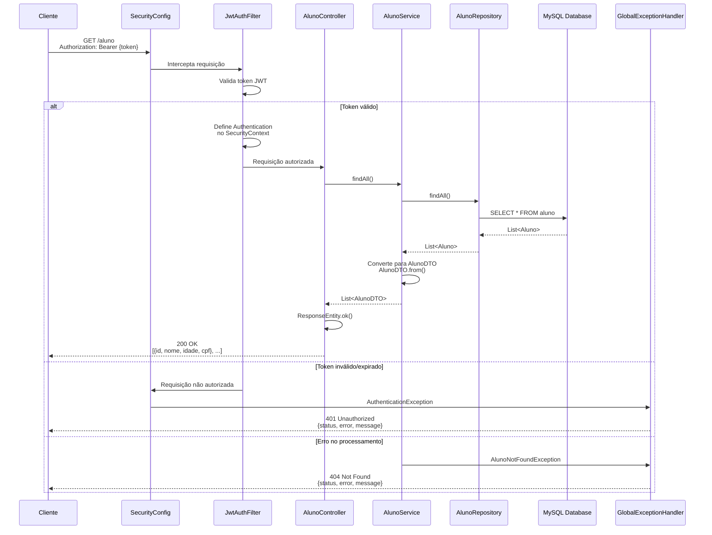
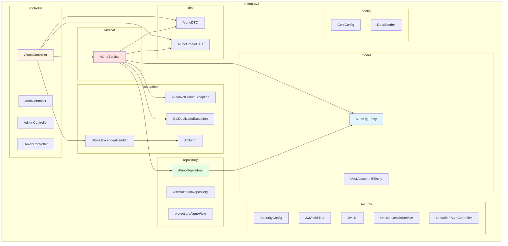
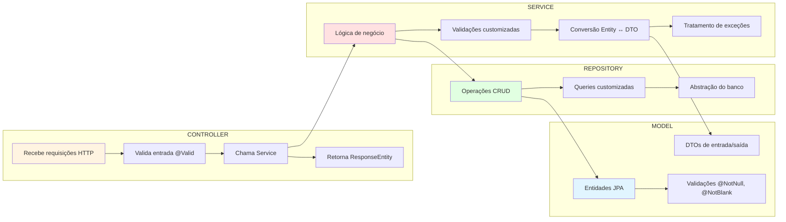

# Arquitetura MVC do Sistema de Indicadores Acadêmicos

## Visão Geral da Arquitetura

```mermaid
graph TB
    subgraph "Camada de Apresentação (Presentation Layer)"
        Client[Cliente/Frontend<br/>Postman/Browser]
        Client --> API[REST API<br/>http://localhost:8081]
    end
    
    subgraph "Camada de Controle (Controller Layer)"
        AC[AlunoController<br/>@RestController]
        AUTH[AuthController<br/>@RestController]
        ADMIN[AdminController<br/>@RestController]
        HC[HealthController<br/>@RestController]
    end
    
    subgraph "Camada de Segurança (Security Layer)"
        SC[SecurityConfig<br/>@Configuration]
        JAF[JwtAuthFilter<br/>@Component]
        JU[JwtUtil<br/>@Component]
        UDS[UserDetailsService<br/>@Service]
    end
    
    subgraph "Camada de Serviço (Service Layer)"
        AS[AlunoService<br/>@Service]
        AS --> |Validações| AS
        AS --> |Regras de Negócio| AS
    end
    
    subgraph "Camada de Dados (Data Layer)"
        AR[AlunoRepository<br/>JpaRepository]
        UR[UserAccountRepository<br/>JpaRepository]
    end
    
    subgraph "Camada de Modelo (Model Layer)"
        AM[Aluno<br/>@Entity]
        UA[UserAccount<br/>@Entity]
        ADTO[AlunoDTO<br/>Data Transfer Object]
        ACDTO[AlunoCreateDTO<br/>Input DTO]
    end
    
    subgraph "Camada de Exceções (Exception Layer)"
        GEH[GlobalExceptionHandler<br/>@RestControllerAdvice]
        ANF[AlunoNotFoundException]
        CDE[CpfDuplicadoException]
        AE[ApiError]
    end
    
    subgraph "Banco de Dados"
        DB[(MySQL Database<br/>av2)]
        DB --> |Tabelas| T1[aluno]
        DB --> |Tabelas| T2[users]
    end
    
    API --> SC
    SC --> JAF
    JAF --> AC
    JAF --> AUTH
    JAF --> ADMIN
    JAF --> HC
    
    AC --> AS
    AUTH --> UDS
    ADMIN --> UR
    
    AS --> AR
    AR --> AM
    AM --> ADTO
    AS --> ACDTO
    
    AR --> DB
    UR --> DB
    
    AC --> GEH
    AS --> ANF
    AS --> CDE
    GEH --> AE
    
    style Client fill:#e1f5ff
    style AC fill:#fff4e1
    style AS fill:#ffe1e1
    style AR fill:#e1ffe1
    style DB fill:#f0f0f0
    style GEH fill:#ffe1e1
```

## Fluxo de Requisição Completo



## Camadas da Arquitetura MVC

```mermaid
graph TB
    subgraph "1. CAMADA DE APRESENTAÇÃO"
        direction LR
        P1[Postman]
        P2[Frontend HTML/JS]
        P3[cURL]
    end
    
    subgraph "2. CAMADA DE CONTROLE (Controller)"
        direction TB
        C1[AlunoController<br/>@RequestMapping("/aluno")]
        C2[AuthController<br/>@RequestMapping("/auth")]
        C3[AdminController<br/>@RequestMapping("/admin")]
        C4[HealthController<br/>@RequestMapping("/")]
    end
    
    subgraph "3. CAMADA DE SEGURANÇA"
        direction TB
        S1[SecurityConfig<br/>SecurityFilterChain]
        S2[JwtAuthFilter<br/>Validação de Token]
        S3[GlobalExceptionHandler<br/>Tratamento de Erros]
    end
    
    subgraph "4. CAMADA DE SERVIÇO (Service)"
        direction TB
        SV1[AlunoService<br/>@Transactional]
        SV2[Validações de Negócio]
        SV3[Conversão Entity ↔ DTO]
    end
    
    subgraph "5. CAMADA DE REPOSITÓRIO (Repository)"
        direction TB
        R1[AlunoRepository<br/>JpaRepository]
        R2[UserAccountRepository<br/>JpaRepository]
    end
    
    subgraph "6. CAMADA DE MODELO (Model)"
        direction TB
        M1[Aluno<br/>@Entity]
        M2[UserAccount<br/>@Entity]
        M3[AlunoDTO<br/>Output]
        M4[AlunoCreateDTO<br/>Input]
    end
    
    subgraph "7. BANCO DE DADOS"
        DB[(MySQL)]
    end
    
    P1 --> C1
    P2 --> C1
    P3 --> C1
    
    C1 --> S1
    C2 --> S1
    C3 --> S1
    C4 --> S1
    
    S1 --> S2
    S2 --> C1
    S2 --> C2
    
    C1 --> SV1
    C2 --> SV1
    
    SV1 --> SV2
    SV1 --> SV3
    
    SV1 --> R1
    SV1 --> R2
    
    R1 --> M1
    R2 --> M2
    
    SV3 --> M3
    SV3 --> M4
    
    R1 --> DB
    R2 --> DB
    
    C1 --> S3
    SV1 --> S3
    
    style C1 fill:#fff4e1
    style SV1 fill:#ffe1e1
    style R1 fill:#e1ffe1
    style M1 fill:#e1f5ff
    style DB fill:#f0f0f0
```

## Fluxo de Dados (CRUD)

```mermaid
flowchart TD
    Start([Requisição HTTP]) --> Auth{Autenticado?}
    Auth -->|Não| Error1[401 Unauthorized]
    Auth -->|Sim| Route{Rota?}
    
    Route -->|GET /aluno| List[AlunoController.findAll]
    Route -->|GET /aluno/{id}| Get[AlunoController.findById]
    Route -->|POST /aluno| Create[AlunoController.create]
    Route -->|PUT /aluno/{id}| Update[AlunoController.update]
    Route -->|DELETE /aluno/{id}| Delete[AlunoController.delete]
    
    List --> Service1[AlunoService.findAll]
    Get --> Service2[AlunoService.findById]
    Create --> Service3[AlunoService.create]
    Update --> Service4[AlunoService.update]
    Delete --> Service5[AlunoService.delete]
    
    Service1 --> Repo1[AlunoRepository.findAll]
    Service2 --> Repo2[AlunoRepository.findById]
    Service3 --> Repo3[AlunoRepository.save]
    Service4 --> Repo4[AlunoRepository.save]
    Service5 --> Repo5[AlunoRepository.deleteById]
    
    Repo1 --> DB[(MySQL)]
    Repo2 --> DB
    Repo3 --> DB
    Repo4 --> DB
    Repo5 --> DB
    
    DB --> Repo1
    DB --> Repo2
    DB --> Repo3
    DB --> Repo4
    
    Repo1 --> Convert1[Entity → DTO]
    Repo2 --> Convert2[Entity → DTO]
    Repo3 --> Convert3[Entity → DTO]
    Repo4 --> Convert4[Entity → DTO]
    
    Convert1 --> Response1[200 OK<br/>List<AlunoDTO>]
    Convert2 --> Response2[200 OK<br/>AlunoDTO]
    Convert3 --> Response3[201 Created<br/>AlunoDTO]
    Convert4 --> Response4[200 OK<br/>AlunoDTO]
    Repo5 --> Response5[204 No Content]
    
    style Error1 fill:#ffcccc
    style Response1 fill:#ccffcc
    style Response2 fill:#ccffcc
    style Response3 fill:#ccffcc
    style Response4 fill:#ccffcc
    style Response5 fill:#ccffcc
```

## Estrutura de Pacotes (Package Structure)



## Responsabilidades por Camada



