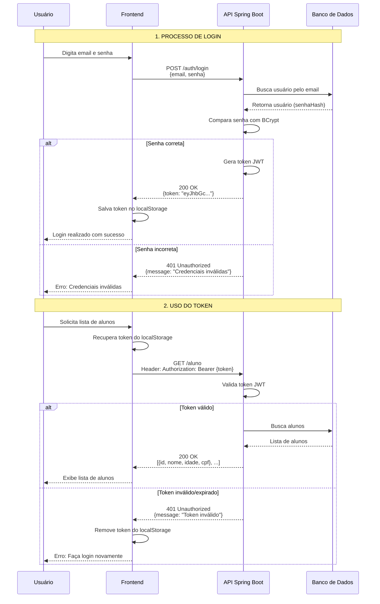
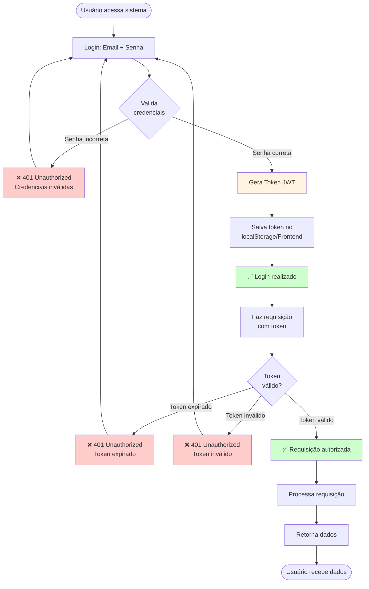
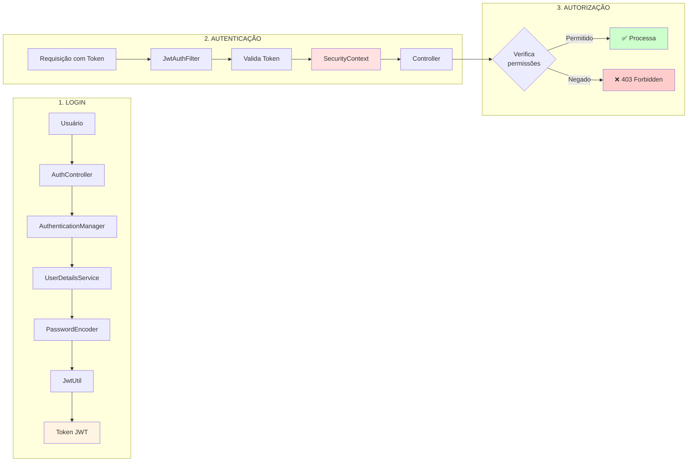
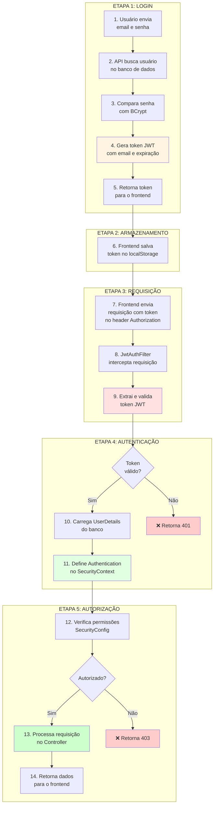
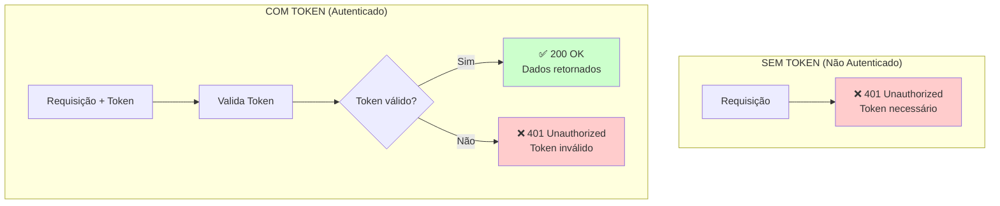
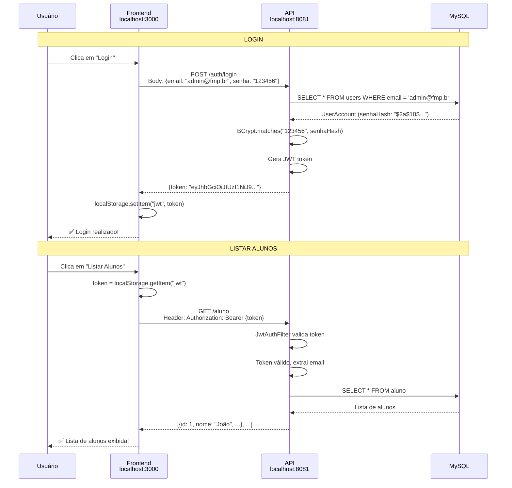
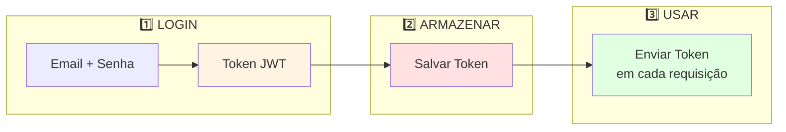
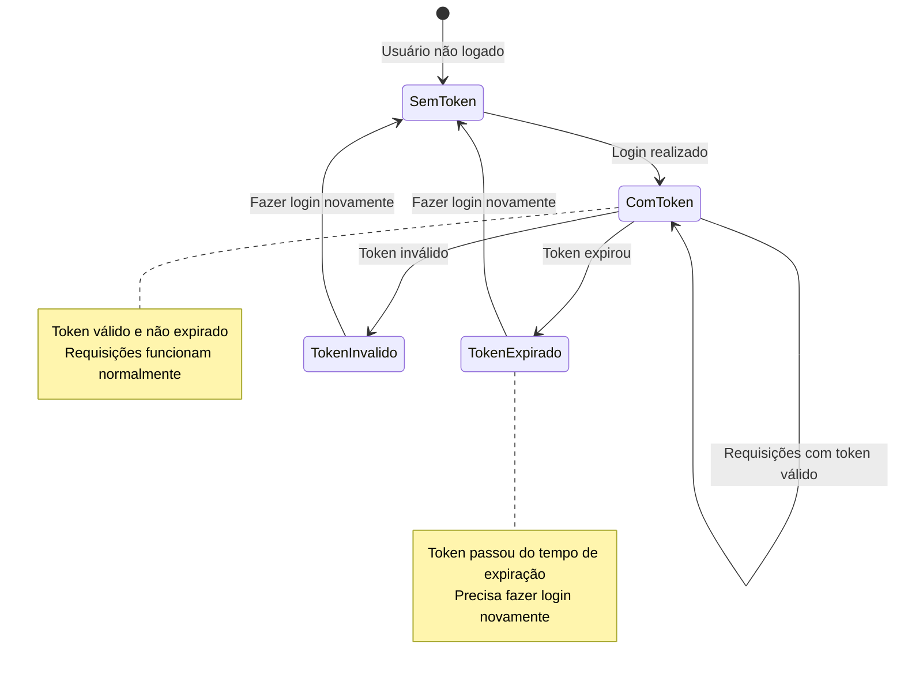

# Fluxo Básico de Autenticação

## Fluxo Simples de Login e Uso do Token

## Fluxo Visual Simplificado

## Componentes Básicos

## Passo a Passo do Fluxo

## Comparação: Com e Sem Token

## Exemplo Prático: Login e Listar Alunos

## Resumo em 3 Passos

## Estados do Token

