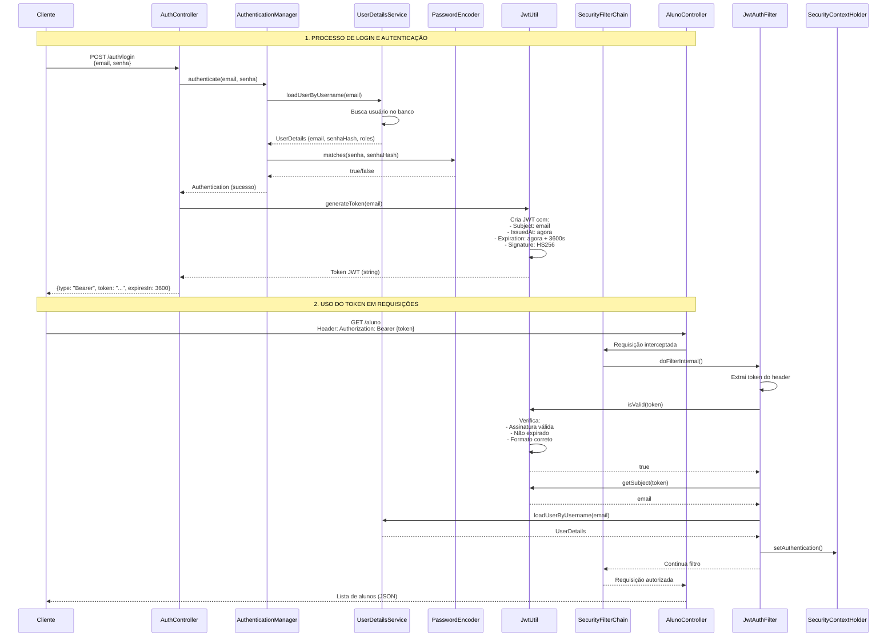
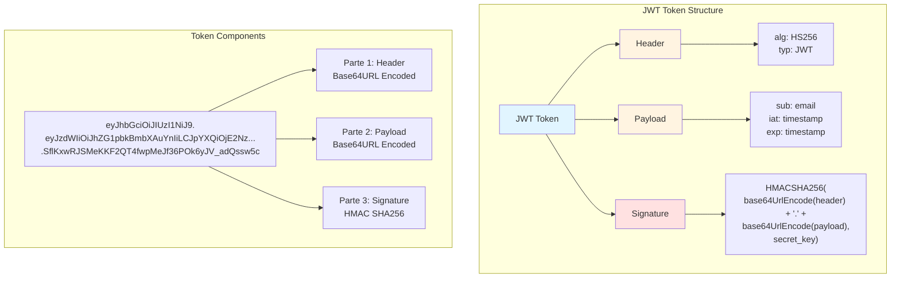
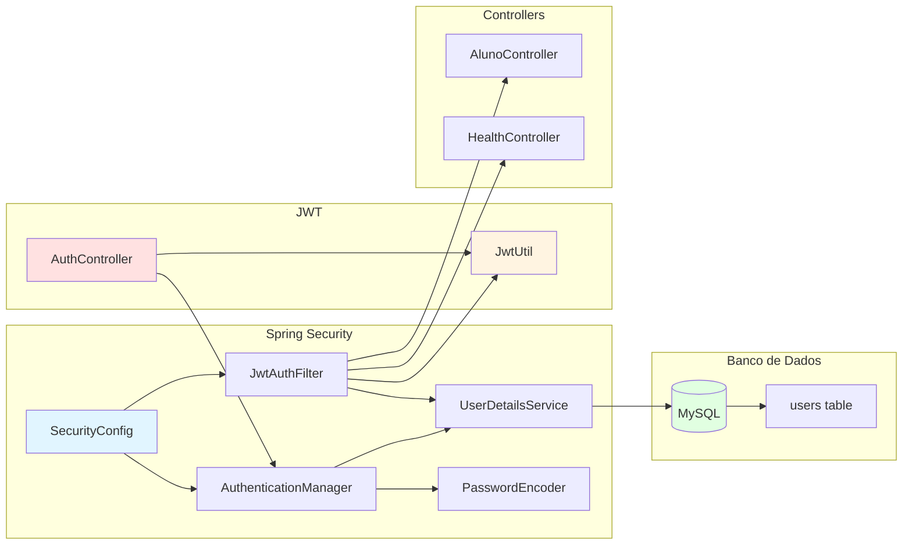
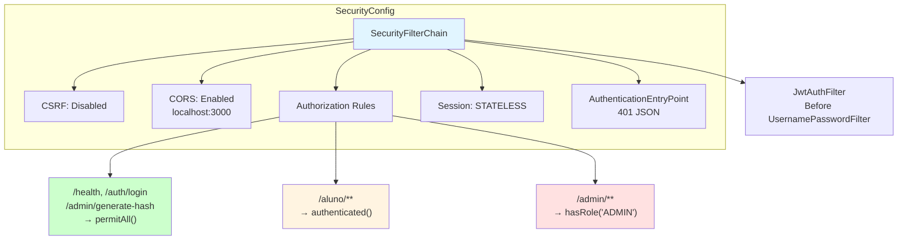

# Estrutura e Fluxo do Token JWT

## Diagrama de Fluxo



## Estrutura do Token JWT



## Fluxo de Validação

```mermaid
flowchart TD
    Start([Cliente envia requisição]) --> HasToken{Header Authorization<br/>presente?}
    HasToken -->|Não| Reject1[❌ 401 Unauthorized]
    HasToken -->|Sim| ExtractToken[Extrair token do header<br/>Bearer {token}]
    ExtractToken --> ValidFormat{Formato válido?<br/>3 partes separadas por '.'}
    ValidFormat -->|Não| Reject2[❌ Token inválido]
    ValidFormat -->|Sim| DecodeHeader[Decodificar Header<br/>Base64URL]
    DecodeHeader --> CheckAlg{Algoritmo = HS256?}
    CheckAlg -->|Não| Reject3[❌ Algoritmo inválido]
    CheckAlg -->|Sim| DecodePayload[Decodificar Payload<br/>Base64URL]
    DecodePayload --> CheckExp{Token expirado?<br/>exp < agora}
    CheckExp -->|Sim| Reject4[❌ Token expirado]
    CheckExp -->|Não| VerifySignature[Verificar assinatura<br/>HMAC SHA256]
    VerifySignature --> SigValid{Assinatura válida?}
    SigValid -->|Não| Reject5[❌ Assinatura inválida]
    SigValid -->|Sim| ExtractEmail[Extrair email do<br/>subject do payload]
    ExtractEmail --> LoadUser[Carregar UserDetails<br/>do banco]
    LoadUser --> SetAuth[Definir Authentication<br/>no SecurityContext]
    SetAuth --> Allow[✅ Requisição autorizada]
    Allow --> Process[Processar requisição]
    
    style Reject1 fill:#ffcccc
    style Reject2 fill:#ffcccc
    style Reject3 fill:#ffcccc
    style Reject4 fill:#ffcccc
    style Reject5 fill:#ffcccc
    style Allow fill:#ccffcc
    style Process fill:#ccffcc
```

## Componentes do Sistema JWT



## Configuração de Segurança



