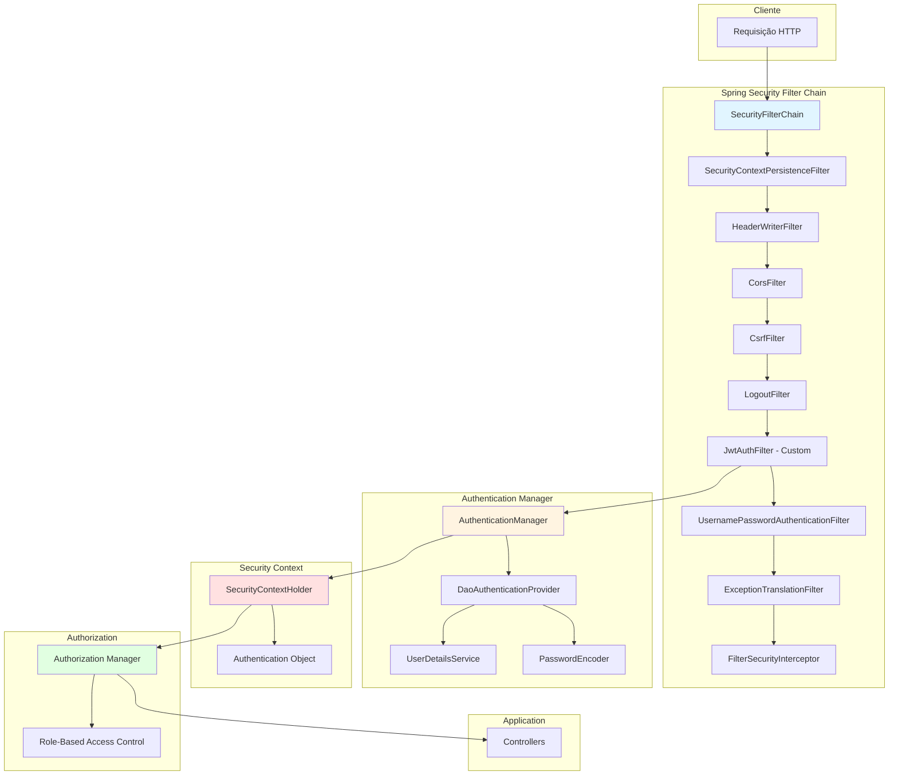
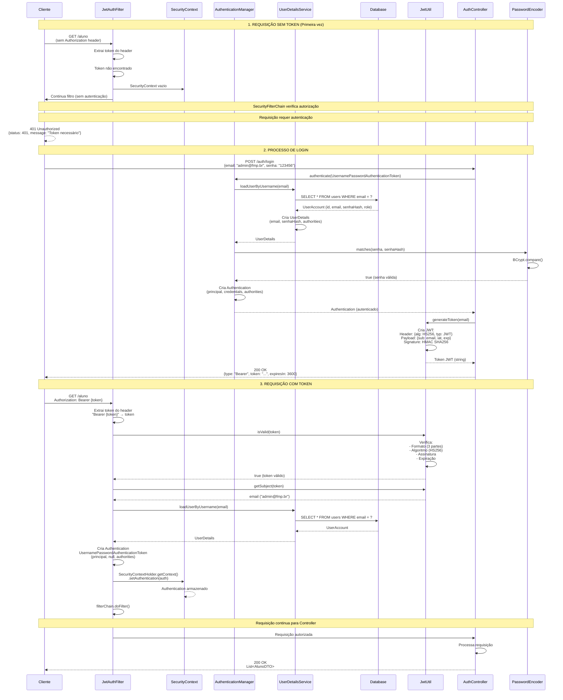
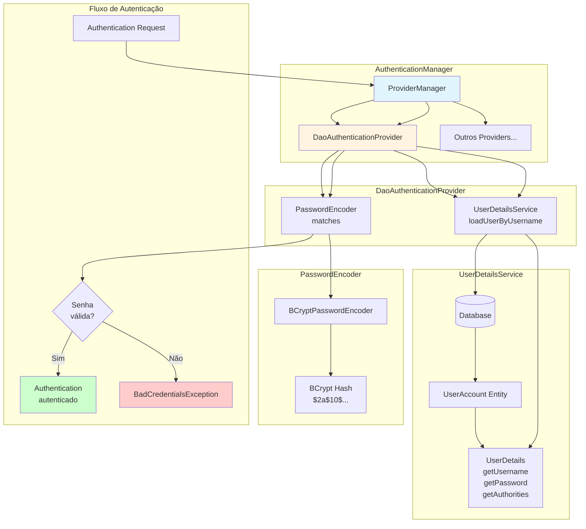
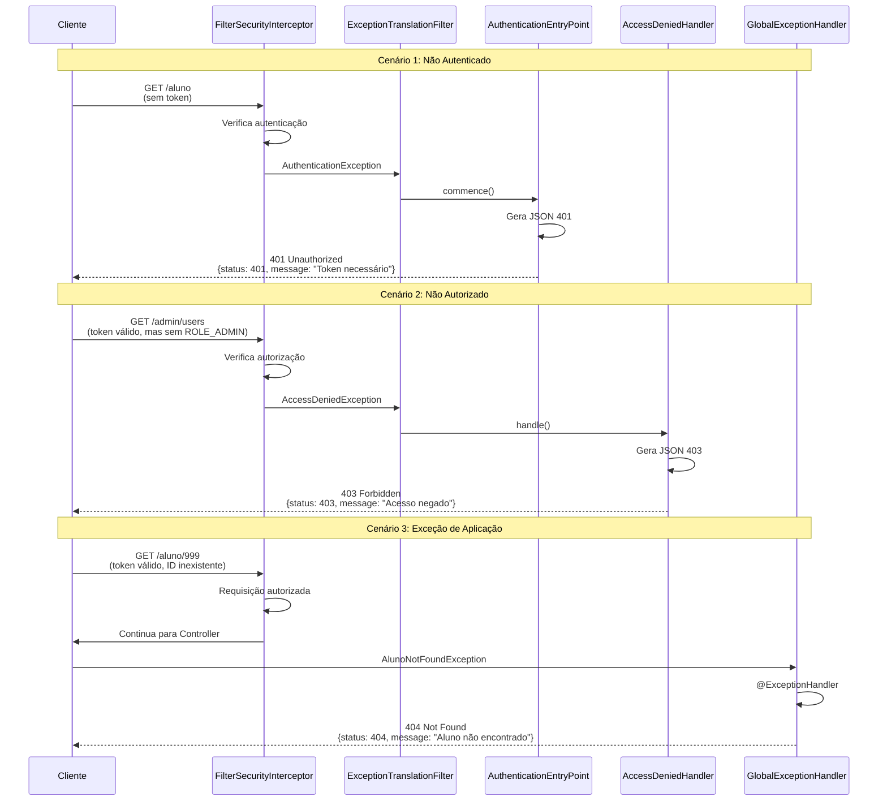
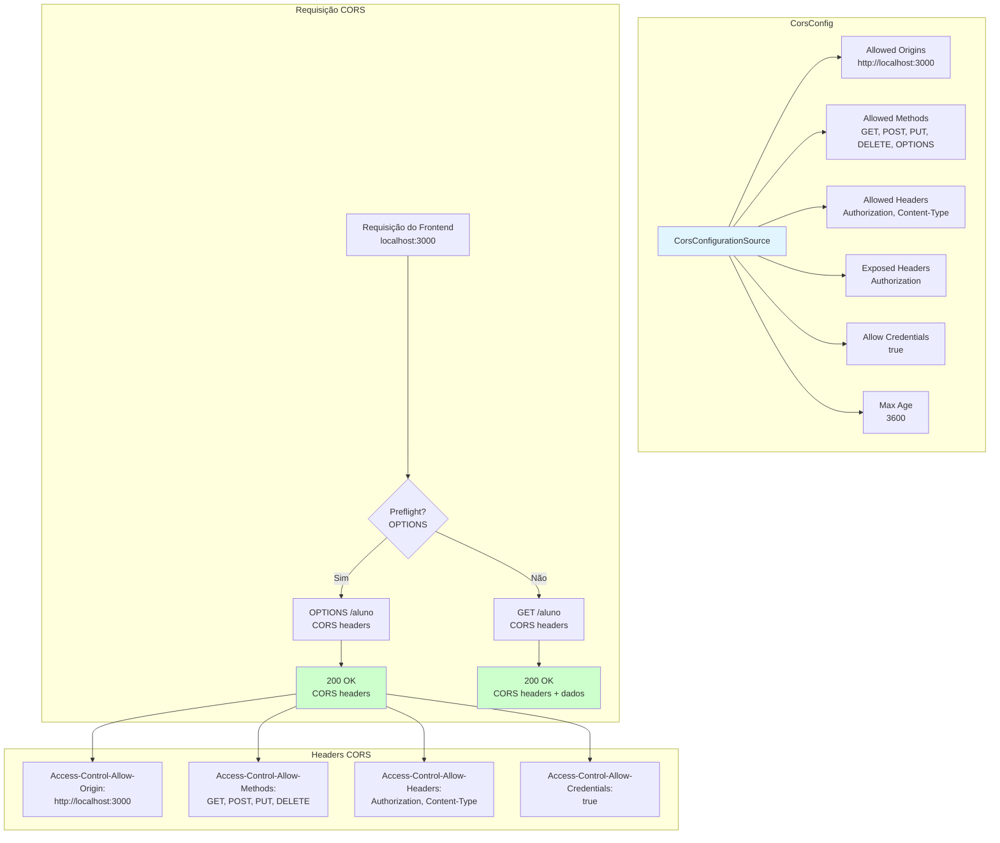
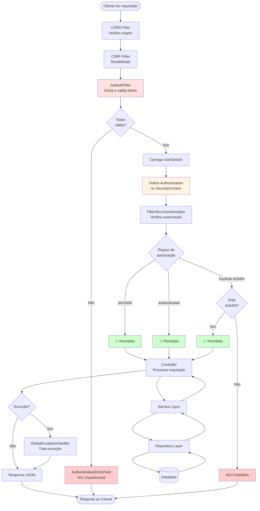

# Fluxo de Autenticação e Segurança com Spring Security

## Visão Geral do Spring Security



## Fluxo Completo de Autenticação



## Filtros do Spring Security (Filter Chain)

```mermaid
graph LR
    subgraph "Spring Security Filter Chain"
        direction TB
        R[Requisição HTTP] --> F1[1. SecurityContextPersistenceFilter<br/>Carrega SecurityContext]
        F1 --> F2[2. HeaderWriterFilter<br/>Adiciona headers de segurança]
        F2 --> F3[3. CorsFilter<br/>Processa CORS]
        F3 --> F4[4. CsrfFilter<br/>Valida CSRF token]
        F4 --> F5[5. LogoutFilter<br/>Processa logout]
        F5 --> F6[6. JwtAuthFilter ⭐<br/>Valida JWT e autentica]
        F6 --> F7[7. UsernamePasswordAuthenticationFilter<br/>Processa login form]
        F7 --> F8[8. ExceptionTranslationFilter<br/>Trata exceções de segurança]
        F8 --> F9[9. FilterSecurityInterceptor<br/>Verifica autorização]
    end
    
    F9 --> |Autorizado| APP[Controllers]
    F9 --> |Não autorizado| ERR[401/403]
    
    style F6 fill:#ffe1e1
    style F9 fill:#fff4e1
    style APP fill:#ccffcc
    style ERR fill:#ffcccc
```



## JwtAuthFilter - Detalhamento

```mermaid
flowchart TD
    Start([Requisição HTTP]) --> Extract[Extrair token do header<br/>Authorization: Bearer {token}]
    Extract --> HasToken{Token<br/>presente?}
    
    HasToken -->|Não| Skip[Pular autenticação<br/>Continua filtro]
    Skip --> End1[Requisição continua<br/>sem autenticação]
    
    HasToken -->|Sim| Validate[Validar token<br/>JwtUtil.isValid]
    Validate --> Valid{Token<br/>válido?}
    
    Valid -->|Não| Clear[Limpar SecurityContext]
    Clear --> End2[Requisição continua<br/>sem autenticação]
    
    Valid -->|Sim| GetSubject[Extrair email<br/>JwtUtil.getSubject]
    GetSubject --> LoadUser[Carregar UserDetails<br/>UserDetailsService]
    LoadUser --> CreateAuth[Criar Authentication<br/>UsernamePasswordAuthenticationToken]
    CreateAuth --> SetContext[Definir no SecurityContext<br/>SecurityContextHolder.getContext()<br/>.setAuthentication]
    SetContext --> Continue[filterChain.doFilter<br/>Continua para próximo filtro]
    Continue --> End3[Requisição autenticada]
    
    style Validate fill:#fff4e1
    style LoadUser fill:#ffe1e1
    style SetContext fill:#e1ffe1
    style End3 fill:#ccffcc
```

## SecurityConfig - Configuração de Segurança

```mermaid
graph TB
    subgraph "SecurityConfig @Configuration"
        SC[SecurityFilterChain Bean]
        
        SC --> CSRF[CSRF Configuration<br/>.csrf(AbstractHttpConfigurer::disable)]
        SC --> CORS[CORS Configuration<br/>.cors(corsConfig)]
        SC --> AUTH[Authorization Rules<br/>.authorizeHttpRequests]
        SC --> SESSION[Session Management<br/>.sessionManagement<br/>STATELESS]
        SC --> ENTRY[Exception Handling<br/>.exceptionHandling<br/>authenticationEntryPoint]
        SC --> FILTER[Add Custom Filter<br/>.addFilterBefore<br/>JwtAuthFilter]
    end
    
    subgraph "Authorization Rules"
        AUTH --> PUBLIC["/health, /error<br/>/auth/login<br/>/admin/generate-hash<br/>→ permitAll()"]
        AUTH --> PROTECTED["/aluno/**<br/>→ authenticated()"]
        AUTH --> ADMIN["/admin/**<br/>→ hasRole('ADMIN')"]
    end
    
    subgraph "Beans"
        SC --> BEAN1[PasswordEncoder<br/>BCryptPasswordEncoder]
        SC --> BEAN2[DaoAuthenticationProvider<br/>UserDetailsService + PasswordEncoder]
        SC --> BEAN3[AuthenticationManager<br/>ProviderManager]
    end
    
    style SC fill:#e1f5ff
    style PUBLIC fill:#ccffcc
    style PROTECTED fill:#fff4e1
    style ADMIN fill:#ffe1e1
```

## AuthenticationManager e Providers



## SecurityContext e Thread-Local Storage

```mermaid
graph TB
    subgraph "SecurityContextHolder"
        SCH[SecurityContextHolder<br/>ThreadLocal<SecurityContext>]
        SCH --> SC[SecurityContext]
        SC --> AUTH[Authentication Object]
    end
    
    subgraph "Authentication Object"
        AUTH --> PRINCIPAL[Principal<br/>UserDetails]
        AUTH --> CREDENTIALS[Credentials<br/>null após autenticação]
        AUTH --> AUTHORITIES[Authorities<br/>Collection<GrantedAuthority>]
        AUTH --> AUTHENTICATED[authenticated: true]
    end
    
    subgraph "UserDetails"
        PRINCIPAL --> UD[UserDetails Interface]
        UD --> USERNAME[getUsername: String]
        UD --> PASSWORD[getPassword: String]
        UD --> AUTHORITIES2[getAuthorities: Collection]
        UD --> ENABLED[isEnabled: boolean]
    end
    
    subgraph "GrantedAuthority"
        AUTHORITIES --> GA[GrantedAuthority]
        GA --> ROLE1[ROLE_ADMIN]
        GA --> ROLE2[ROLE_USER]
    end
    
    subgraph "Acesso no Controller"
        CONTROLLER[Controller] --> GETAUTH[SecurityContextHolder<br/>.getContext()<br/>.getAuthentication()]
        GETAUTH --> PRINCIPAL2[getPrincipal()]
        PRINCIPAL2 --> USERINFO[UserDetails<br/>Informações do usuário]
    end
    
    style SCH fill:#e1f5ff
    style AUTH fill:#fff4e1
    style UD fill:#ffe1e1
    style CONTROLLER fill:#e1ffe1
```

## Fluxo de Autorização (Authorization)

```mermaid
flowchart TD
    Start([Requisição Autenticada]) --> CheckAuth{Autenticado?}
    
    CheckAuth -->|Não| Reject1[401 Unauthorized<br/>AuthenticationEntryPoint]
    CheckAuth -->|Sim| GetAuth[Obter Authentication<br/>do SecurityContext]
    
    GetAuth --> GetRoles[Obter Roles/Authorities<br/>getAuthorities()]
    GetRoles --> CheckRoute{Rota?}
    
    CheckRoute -->|/health, /auth/login| Allow1[✅ permitAll<br/>Permitido]
    CheckRoute -->|/aluno/**| CheckAuth2{authenticated?}
    CheckRoute -->|/admin/**| CheckRole{hasRole<br/>'ADMIN'?}
    
    CheckAuth2 -->|Sim| Allow2[✅ authenticated<br/>Permitido]
    CheckAuth2 -->|Não| Reject2[403 Forbidden]
    
    CheckRole -->|Sim| Allow3[✅ hasRole ADMIN<br/>Permitido]
    CheckRole -->|Não| Reject3[403 Forbidden<br/>Access Denied]
    
    Allow1 --> Process[Processar Requisição]
    Allow2 --> Process
    Allow3 --> Process
    
    Reject1 --> End1[Retornar JSON Error]
    Reject2 --> End2[Retornar JSON Error]
    Reject3 --> End3[Retornar JSON Error]
    
    style Allow1 fill:#ccffcc
    style Allow2 fill:#ccffcc
    style Allow3 fill:#ccffcc
    style Reject1 fill:#ffcccc
    style Reject2 fill:#ffcccc
    style Reject3 fill:#ffcccc
```

## Exception Handling no Spring Security



## CORS Configuration



## Comparação: Autenticação vs Autorização

```mermaid
graph TB
    subgraph "AUTENTICAÇÃO (Authentication)"
        AUTH1[Quem é você?]
        AUTH1 --> AUTH2[Verifica identidade]
        AUTH2 --> AUTH3[Email + Senha]
        AUTH3 --> AUTH4[JWT Token]
        AUTH4 --> AUTH5[SecurityContext<br/>Authentication Object]
        AUTH5 --> AUTH6[✅ Autenticado]
    end
    
    subgraph "AUTORIZAÇÃO (Authorization)"
        AUTHZ1[O que você pode fazer?]
        AUTHZ1 --> AUTHZ2[Verifica permissões]
        AUTHZ2 --> AUTHZ3[Roles/Authorities]
        AUTHZ3 --> AUTHZ4[hasRole('ADMIN')]
        AUTHZ4 --> AUTHZ5[SecurityConfig<br/>Authorization Rules]
        AUTHZ5 --> AUTHZ6[✅ Autorizado]
    end
    
    AUTH6 --> AUTHZ1
    
    style AUTH1 fill:#fff4e1
    style AUTH6 fill:#ccffcc
    style AUTHZ1 fill:#ffe1e1
    style AUTHZ6 fill:#ccffcc
```

## Resumo do Fluxo Completo



